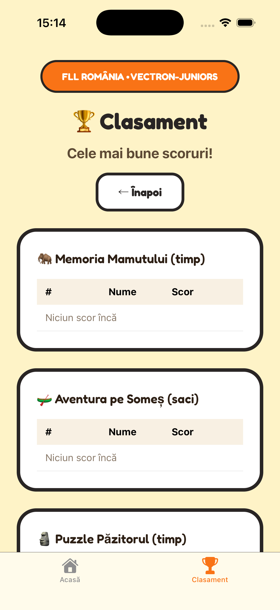

# Documentație Proiect — Vectron-Juniors

## Proiect FLL România • Descoperiri de la Dej

**Document destinat juriului** — Prezentare cuprinzătoare a site-ului web, aplicației mobile și jocurilor educaționale.

---

## 1. Prezentare generală a proiectului

**Vectron-Juniors** este un proiect realizat pentru **FLL Nationals România** (FIRST LEGO League), care combină educația și jocurile interactive pentru a prezenta **descoperirile istorice și arheologice din regiunea Dej**. Proiectul include:

- **Site web** — accesibil din browser, pentru desktop și mobil
- **Aplicație mobilă** — dezvoltată cu Expo/React Native, disponibilă pe **iOS** și **Android**
- **7 jocuri educaționale** — fiecare inspirat din artefacte și descoperiri reale din Dej și împrejurimi

Scopul principal este de a permite copiilor și tinerilor să **joace și să învețe** despre trecutul local prin jocuri interactive și gamificare.

---

## 2. Site-ul web

### 2.1 Structură și arhitectură

Site-ul este construit cu HTML, CSS și JavaScript vanilla, fără framework-uri complexe, pentru **performanță bună** și **accesibilitate largă**. Include:

| Pagină | Rol |
|--------|-----|
| `index.html` | Pagina principală — selecția jocurilor și salutul utilizatorului |
| `leaderboard.html` | Clasamentul global pentru toate jocurile |
| `mammoth.html` | Jocul Memoria Mamutului |
| `monoxyl.html` | Jocul Aventura pe Someș |
| `pazitorul.html` | Puzzle-ul Păzitorului |
| `pietre.html` | Decoderul Înscrisurilor |
| `bratari.html` | Mărgeaua Diferită |
| `secera.html` | Secera cu limbă |
| `legos.html` | Turnul LEGO (joc secret deblocabil) |
| `privacy.html` | Politică de confidențialitate |

### 2.2 Tehnologii utilizate

- **Firebase Realtime Database** — pentru clasamente și sincronizare scoruri
- **LocalStorage** — pentru numele utilizatorului și progresul local
- **Fonturi** — Fredoka (titluri) și Nunito (text)
- **Design responsive** — adaptat pentru telefoane, tablete și desktop

### 2.3 Flux utilizator pe site

1. La prima vizită, utilizatorul introduce un **nume** (max. 20 caractere), salvat în browser
2. Poate schimba numele oricând prin butonul „Schimbă numele”
3. Alege un joc din grila de jocuri
4. Fiecare joc are un **overlay educațional** la început — explică contextul istoric
5. După finalizare, scorul poate fi trimis la **clasament**
6. După ce completează **toate cele 6 jocuri principale**, se **deblochează Turnul LEGO**

---

## 3. Aplicația mobilă

### 3.1 Prezentare tehnică

Aplicația este construită cu **Expo** (React Native), ceea ce permite:

- **Build-uri native** pentru iOS și Android
- **Versiune web** (PWA) — poate fi deschisă în browser
- **Actualizări rapide** fără re-publicare în store

### 3.2 Identificare aplicație

| Parametru | Valoare |
|-----------|---------|
| Nume | vectron-juniors |
| Versiune | 1.0.0 |
| Bundle ID (iOS) | com.vectronjuniors.vectronjuniors |
| Package (Android) | com.vectronjuniors.vectronjuniors |

### 3.3 Structura aplicației

- **Navigare prin tab-uri**: Acasă | Clasament
- **Ecran principal** — grila de jocuri, similar cu site-ul
- **Ecran joc** — fiecare joc se deschide într-un ecran dedicat
- **Modal de educație** — la începutul fiecărui joc, conținut istoric
- **Rezervare nume** — verificare Firebase pentru evitarea duplicatelor în clasament

### 3.4 Screenshot: Ecranul principal al aplicației

*Ecranul principal al aplicației pe iOS. Se observă: antet FLL România • Vectron-Juniors, titlul „Descoperiri de la Dej”, salutul personalizat („Salut, Ryan!”), butonul Clasament, mesajul despre deblocarea Turnului LEGO și grila de jocuri. Navigare inferioară: Acasă și Clasament.*

---

## 4. Clasamentul (Leaderboard)

### 4.1 Funcționalitate

Clasamentul afișează **cele mai bune scoruri** pentru fiecare joc în parte:

- Memoria Mamutului (timp)
- Aventura pe Someș (saci de sare)
- Puzzle Păzitorul (timp)
- Decoder Înscrisurilor (timp)
- Mărgeaua Diferită (secunde)
- Secera (cereale)
- Turnul LEGO (cărămizi)

Datele sunt stocate în **Firebase Realtime Database** și sincronizate între site și aplicație.

### 4.2 Screenshot: Ecranul Clasament

*Ecranul Clasament din aplicația mobilă. Se observă clasamente separate pentru Memoria Mamutului, Aventura pe Someș și Puzzle Păzitorul. Fiecare joc are propriul tabel cu poziție, nume și scor. Bară de navigare inferioară cu Acasă și Clasament.*

---

## 5. Jocurile educaționale — descriere detaliată

### 5.1 Jocul 1: Memoria Mamutului

**Tip:** Memory (găsește perechile)  
**Scor:** Timp (secunde) — mai puțin = mai bine  
**Context educațional:** La aproximativ 12 km de Dej, în zona Nireș, au fost descoperite fragmente fosile de mamut. Jocul folosește simboluri inspirate din natură (🦴, 🪵, ❄️, 🌿, 🦣, ⛰️) pentru a reprezenta fragmente fosile.

**Mecanică:** Jucătorul întoarce cărțile și găsește perechile. La final, timpul este înregistrat și poate fi trimis la clasament.

### 5.2 Jocul 2: Aventura pe Someș

**Tip:** Arcade — conducere barcă  
**Scor:** Număr de saci de sare strânși  
**Context educațional:** Monoxila este o barcă făcută dintr-un singur trunchi de copac. Pe Someș transportau sare — o resursă prețioasă în antichitate.

**Mecanică:** Jucătorul conduce monoxila cu săgețile sau butoanele, strânge sacii de sare care cad și evită stâncile. Dacă lovește o stâncă, jocul se termină.

### 5.3 Jocul 3: Puzzle-ul Păzitorului

**Tip:** Puzzle (slide)  
**Scor:** Timp (secunde)  
**Context educațional:** Păzitorul este o statuie care sugerează existența unor monumente cu rol simbolic sau religios, arătând credințe, artă și nevoie de protecție spirituală.

**Mecanică:** Jucătorul amestecă și reconstituie puzzle-ul cu 9 piese. Timpul completării este scorul.

### 5.4 Jocul 4: Decoderul Înscrisurilor

**Tip:** Decodare / Cipher  
**Scor:** Timp (secunde)  
**Context educațional:** Pietrele funerare din regiune conțin inscripții codate. Simbolurile pot fi decodificate pentru a descoperi povești despre viața din antichitate.

**Mecanică:** Jucătorul primește o cheie de decodare (simbol → literă) și trebuie să găsească cuvinte precum DACIA, ROMA, CASEIU, DEJ.

### 5.5 Jocul 5: Mărgeaua Diferită

**Tip:** Găsește diferența / Reacție  
**Scor:** Timp (secunde) — cât mai rapid găsești mărgeaua  
**Context educațional:** Brățările antice aveau mărgele de culori diverse. Jucătorul trebuie să găsească mărgeaua care are o culoare diferită de celelalte.

**Mecanică:** Se afișează o brățară cu mărgele (auriu, bronz, cupru, argintiu). Una are culoarea diferită. Jucătorul apasă pe ea cât mai repede.

### 5.6 Jocul 6: Secera cu limbă

**Tip:** Arcade — strângere în timp limitat  
**Scor:** Număr de cereale strânse în 30 secunde  
**Context educațional:** Secera cu limbă era folosită pentru strângerea cerealelor. Jucătorul strânge cât mai multe cereale în 30 de secunde.

**Mecanică:** Joc de tip „strânge obiecte” în timp limitat. Scorul = cereale strânse.

### 5.7 Jocul secret: Turnul LEGO

**Tip:** Arcade — prinde obiecte  
**Scor:** Număr de cărămizi prinse  
**Condiție de deblocare:** Completează toate cele 6 jocuri de mai sus  
**Context educațional:** FLL folosește LEGO pentru roboți. Prinde cărămizile care cad și construiește cel mai înalt turn!

**Mecanică:** Cărămizi LEGO cad din partea de sus. Jucătorul mișcă o paletă stânga-dreapta pentru a le prinde. Obiectiv: 10 cărămizi pentru victorie. Dacă ratezi una, jocul se termină.

---

## 6. Screenshots din jocuri

### 6.1 Victoria la Memoria Mamutului

*Ecran de victorie la jocul Memoria Mamutului. Mesaj „Felicitări! Ai găsit toate perechile de fragmente de mamut!” cu timpul realizat (21 sec). Butoane: Înapoi la jocuri | Vezi clasamentul.*

### 6.2 Game Over — Aventura pe Someș

*Ecran de încheiere la Aventura pe Someș — „Ups! Ai lovit o stâncă!”. Afișează sacii strânși (2). Opțiuni: Înapoi la jocuri | Vezi clasamentul. Chiar și la eșec, utilizatorul poate vizualiza clasamentul.*

### 6.3 Gameplay — Turnul LEGO

*Jocul Turnul LEGO în desfășurare. Instrucțiuni: „Prinde cărămizile care cad! Construiește 10 cărămizi pentru a câștiga. Dacă ratezi una, jocul se termină!”. HUD: Timp, Cărămizi 0/10. Paletă roșie pentru prindere și butoane Stânga/Dreapta.*

---

## 7. Elemente de gamificare și UX

| Element | Descriere |
|--------|-----------|
| **Nume personalizat** | Utilizatorul este salutat cu „Salut, [nume]!” |
| **Progres vizual** | Fiecare joc afișează „✓ Complet!” sau „De jucat” |
| **Progres LEGO** | „X / 6 jocuri complete” — indicație clară pentru deblocare |
| **Clasament** | Competiție sănătoasă, motivație pentru îmbunătățire |
| **Overlay educațional** | Învață înainte de a juca — context istoric |
| **Feedback la victorie/eșec** | Mesaje clare (Felicitări!, Ups!) și opțiuni de navigare |

---

## 8. Conectivitate și date

- **Firebase** — Realtime Database pentru:
  - Scoruri pe joc
  - Rezervare nume (evitare duplicate în clasament)
- **LocalStorage** — nume utilizator și progres local (jocuri câștigate)
- **Politică de confidențialitate** — disponibilă pe site și din aplicație

---

## 9. Rezumat pentru juriu

**Vectron-Juniors** oferă:

1. **Experiență multiplatformă** — site web + aplicație iOS/Android
2. **7 jocuri educaționale** conectate la descoperiri reale din Dej (mamut, monoxilă, Păzitorul, pietre funerare, brățări, seceră, LEGO)
3. **Gamificare** — clasamente, progres, joc secret deblocabil
4. **Design coerent** — culori calde, fonturi prietenoase, interfață în română
5. **Valoare educațională** — fiecare joc are un overlay care explică contextul istoric

Proiectul demonstrează integrarea tehnologiei cu patrimoniul cultural local, într-o formă accesibilă și distractivă pentru publicul tânăr.

---

*Documentație pregătită pentru FLL Nationals România — Vectron-Juniors*
